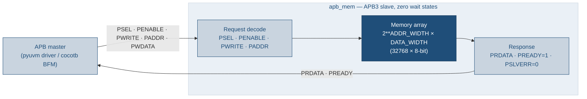
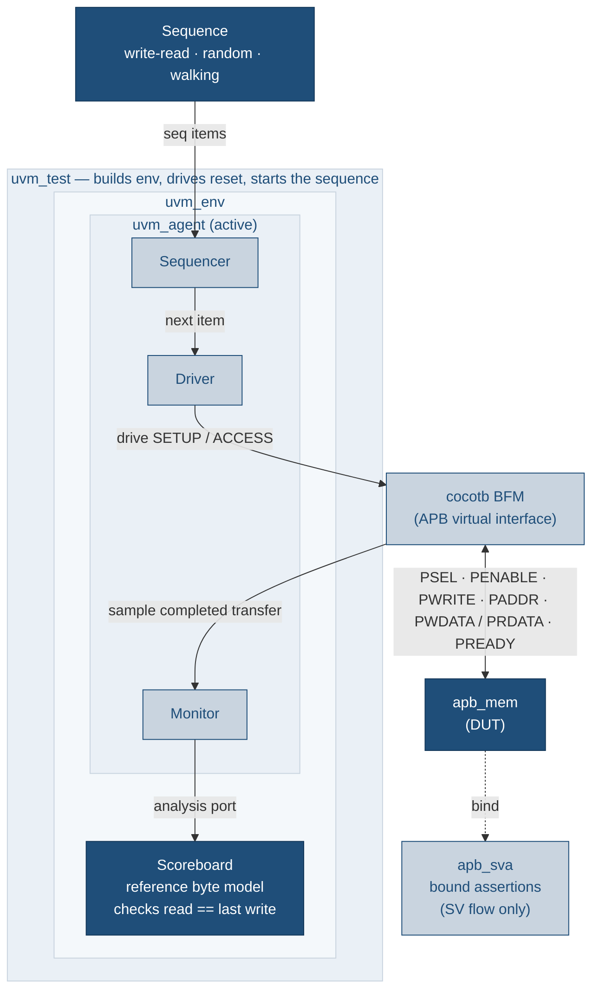

# apb-to-mem-bazel

APB byte-wide 32K memory RTL with a self-checking PyUVM testbench, driven by
**Bazel** instead of GNU Make. This repo is a derivative of
[`uvm_review`](../uvm_review): same RTL, same cocotb/pyuvm testbench, same
low-power / lint / coverage / UVM deliverables — but the Makefile orchestration
is replaced by custom Starlark test rules that drive cocotb's Python runner, with
`test_suite`s + tags standing in for the make targets, and every test exporting a
JSON result.

New here? [`docs/TUTORIAL.md`](docs/TUTORIAL.md) is a hands-on walk through running
the Bazel gates and extending the testbench (with a full "add your own test" example).

## Architecture

`apb_mem` is a zero-wait-state APB3 slave wrapping a byte-wide memory array
(`2**ADDR_WIDTH` locations of `DATA_WIDTH` bits; default 32768 × 8-bit = 32K).
`PREADY` is tied high so every transfer completes in the ACCESS phase and
`PSLVERR` is tied low; writes are gated by `PRESETn`, and the array powers up
all-zero so reads of un-written locations return 0.



The testbench is a layered pyuvm environment; only the BFM touches DUT signals,
and the scoreboard keeps a reference byte model that checks every read against
the last write to that address. The bound `apb_sva` assertions run in the SV/UVM
flow only.



## How the Bazel flow works

Bazel owns the target graph, the runfiles, and the pass/fail contract. The custom
Starlark rules in `bazel/hdl.bzl` (`cocotb_test`, `hdl_tool_test`) generate a
launcher that shells out to the system Python — which carries cocotb + pyuvm — and
the system Icarus/Verilator. This is **non-hermetic by design** (the same reality
the source Makefile lived in), so the sim targets are tagged `local` +
`no-sandbox` + `no-cache`. Running one `@cocotb.test` per Bazel target (its own
`vvp`) gives the source Makefile's "fresh, time-0-zeroed memory per test" for
free. Each runner also exports a JSON result via `bazel/jsonout.py`.

```mermaid
flowchart LR
    BZ["bazel test //:ci<br/>(test_suite + tags)"]:::accent

    subgraph RULES["bazel/hdl.bzl — Starlark rules"]
        direction TB
        CT["cocotb_test<br/>(one target per testcase)"]:::light
        GT["hdl_tool_test<br/>(lint · coverage · uvm)"]:::light
    end

    LAUNCH["generated launcher.sh<br/>exec $APB_PYTHON runner"]:::light

    subgraph RUN["bazel/run_cocotb.py"]
        direction TB
        BUILD["get_runner('icarus').build()<br/>-g2012, 1ns/1ps"]:::light
        VVP["runner.test()<br/>fresh vvp per testcase"]:::light
        BUILD --> VVP
    end

    TB["tb/apb_test.py (pyuvm)<br/>drives apb_mem via cocotb BFM"]:::light
    OUT["results.xml → assert 0 failed<br/>+ result.json (jsonout)"]:::accent

    BZ --> RULES
    RULES --> LAUNCH --> RUN
    VVP --> TB --> OUT

    classDef accent fill:#1F4E79,stroke:#14385A,color:#FFFFFF;
    classDef light fill:#C9D4DF,stroke:#1F4E79,color:#1F4E79;
    style RULES fill:#EAF0F6,stroke:#C9D4DF,color:#1F4E79;
    style RUN fill:#EAF0F6,stroke:#C9D4DF,color:#1F4E79;
```



## Requirements

- **Bazel** (via [Bazelisk](https://github.com/bazelbuild/bazelisk); the repo
  builds with Bazel 9 / Bzlmod). No external Bazel modules are fetched.
- **Icarus Verilog 11** at `/usr/bin/iverilog` (apt). `run_cocotb.py` pins
  `ICARUS_BIN_DIR=/usr/bin` so the apt Icarus is used even when an OSS-CAD-Suite
  `iverilog` shadows it on `PATH`.
- **Python 3.10** with **cocotb 1.9.2 + pyuvm 4.0.1**, in the interpreter the
  launchers exec (`APB_PYTHON`, default `/usr/bin/python3`):

  ```bash
  sudo /usr/bin/python3 -m pip install 'cocotb==1.9.2' 'pyuvm==4.0.1'
  ```
  Point the tests at a different interpreter with
  `bazel test --test_env=APB_PYTHON=/path/to/python //...`.
- **Verilator** (optional) — enables lint and coverage; both skip cleanly when
  it is absent.
- A UVM simulator (VCS / Xcelium / Questa) is only needed for `//:uvm`, which
  otherwise skips.

## `make` → `bazel` mapping

An **optional** `Makefile` wrapper (`make help`) restores the familiar verbs;
each just runs the `bazel test` in the right column.

| Old Make target | bazel command |
|---|---|
| `make test` / `make test-all` | `bazel test //:sim` |
| `make test-write-read` | `bazel test //:sim_write_read_test` |
| `make test-random` | `bazel test //:sim_random_test` |
| `make test-walking` | `bazel test //:sim_walking_test` |
| `make lp` | `bazel test //:lp` |
| `make lint` | `bazel test //:lint` |
| `make coverage` | `bazel test //:coverage` |
| `make uvm` | `bazel test //:uvm` (skips without a UVM simulator) |
| `make check` | `bazel test //:check` |
| `make regress` | `bazel test //:regress` |
| `make ci` | `bazel test //:ci` (or `bazel test //...`) |
| `pytest -m sim` | `bazel test //... --test_tag_filters=sim` |

`COV_MIN=<n> bazel test --test_env=COV_MIN //:coverage` overrides the 100%
line-coverage floor. `UVM_TEST=<name>` (forward it with `--test_env`) picks the
UVM test.

## JSON export

Every test writes a machine-readable `result.json` (gate, status, counts,
coverage %) to Bazel's `TEST_UNDECLARED_OUTPUTS_DIR`; Bazel collects it into
`bazel-testlogs/<target>/test.outputs/outputs.zip` and echoes a `[JSON] {...}`
line to the log. Adding `--config=json` also exports the whole invocation as a
Build Event Protocol JSON stream to `bazel-events.json`.

```bash
bazel test --config=json //:ci
unzip -p bazel-testlogs/coverage/test.outputs/outputs.zip result.json
```

## Waveforms

The `cocotb_test` launcher forwards extra args to the runner, so `--waves` dumps
an FST (into the test's `TEST_TMPDIR`):

```bash
bazel test //:sim_random_test --test_arg=--waves --test_output=all
```

## CI

`.github/workflows/ci.yml` installs Icarus + Verilator + Bazelisk + the Python
deps and runs `bazel test --config=json //:ci`, then uploads the per-test
`result.json` artifacts and the BEP JSON stream.
