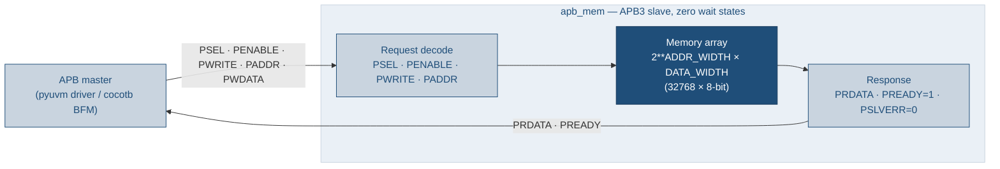
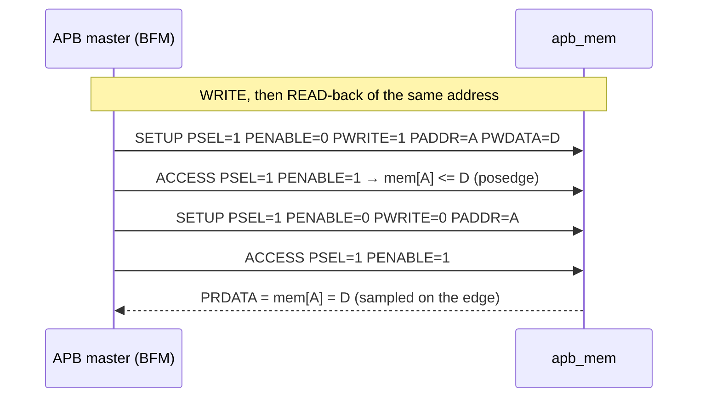
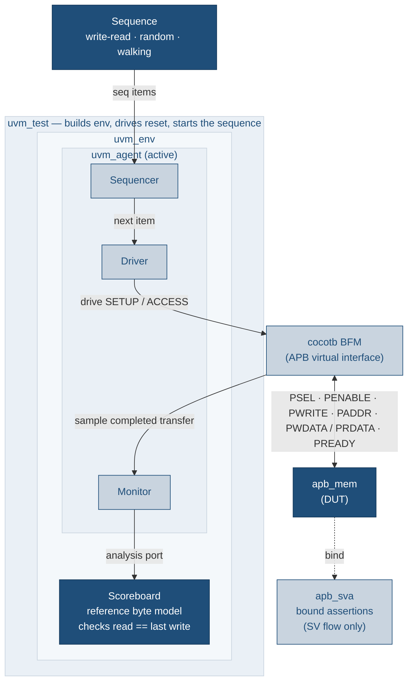
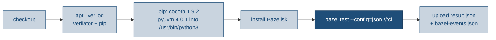

# apb-to-mem-bazel

APB byte-wide 32K memory RTL with a self-checking PyUVM testbench, driven by
**Bazel** instead of GNU Make. This repo is a derivative of
[`uvm_review`](../uvm_review): same RTL, same cocotb/pyuvm testbench, same
low-power / lint / coverage / UVM deliverables — but the Makefile orchestration
is replaced by custom Starlark test rules that drive cocotb's Python runner, with
`test_suite`s + tags standing in for the make targets, and every test exporting a
JSON result.

New here? [`docs/TUTORIAL.md`](docs/TUTORIAL.md) is a hands-on walk through running
the Bazel gates and extending the testbench (with a full "add your own test" example).
[`CLAUDE.md`](CLAUDE.md) is the terse orientation for agents/contributors.

## At a glance

| | |
|---|---|
| **DUT** | `apb_mem` — APB3 slave, 32768 × 8-bit array, zero wait states, never errors |
| **Testbench** | layered pyuvm over a cocotb BFM; reference-model scoreboard |
| **Simulator** | Icarus Verilog 11 (functional), Verilator (lint + coverage) |
| **Orchestration** | Bazel 9 / Bzlmod, custom Starlark rules (`bazel/hdl.bzl`) |
| **Gates** | 3 functional tests · lint · coverage · low-power · UVM (skips w/o license) |
| **Result contract** | every test exits 0/1 **and** writes a `result.json`; opt-in BEP JSON stream |
| **CI** | GitHub Actions → `bazel test --config=json //:ci`, uploads the JSON |

## Architecture

`apb_mem` is a zero-wait-state APB3 slave wrapping a byte-wide memory array
(`2**ADDR_WIDTH` locations of `DATA_WIDTH` bits; default 32768 × 8-bit = 32K).
`PREADY` is tied high so every transfer completes in the ACCESS phase and
`PSLVERR` is tied low; writes are gated by `PRESETn`, and the array powers up
all-zero so reads of un-written locations return 0.



### DUT interface (`rtl/apb_mem.sv`)

Parameters: `ADDR_WIDTH = 15` (⇒ `DEPTH = 2**15 = 32768`), `DATA_WIDTH = 8`.

| Signal | Dir | Width | Role |
|---|---|---|---|
| `PCLK` | in | 1 | Bus clock; the array write is `posedge`-clocked |
| `PRESETn` | in | 1 | Active-low reset; gates writes (no write while low) |
| `PSEL` | in | 1 | Slave select — starts a transfer |
| `PENABLE` | in | 1 | 0 in SETUP, 1 in ACCESS (the second phase) |
| `PWRITE` | in | 1 | 1 = write, 0 = read |
| `PADDR` | in | 15 | Byte address (`0x0000`–`0x7FFF`) |
| `PWDATA` | in | 8 | Write payload |
| `PRDATA` | out | 8 | Read data — combinational, valid throughout ACCESS |
| `PREADY` | out | 1 | Tied **high** (zero wait states) |
| `PSLVERR` | out | 1 | Tied **low** (never errors; coverage-waived) |

### APB transfer phases

Every transfer is exactly two clocks: SETUP then ACCESS. Because `PREADY` is
tied high, ACCESS never extends.

| Phase | `PSEL` | `PENABLE` | `PREADY` | What happens |
|---|:---:|:---:|:---:|---|
| IDLE | 0 | 0 | 1 | Bus quiet |
| SETUP | 1 | 0 | 1 | Address/control driven; nothing commits yet |
| ACCESS | 1 | 1 | 1 | Write commits on this edge; read `PRDATA` sampled here |



The testbench is a layered pyuvm environment; only the BFM touches DUT signals,
and the scoreboard keeps a reference byte model that checks every read against
the last write to that address. The bound `apb_sva` assertions run in the SV/UVM
flow only.



### Testbench components

| Component | File | Responsibility |
|---|---|---|
| `ApbSeqItem` | `tb/apb_seq_item.py` | one transfer (addr/data/write + captured `rdata`); `__eq__`/`__str__` |
| Sequences | `tb/apb_seq.py` | `ApbWriteReadSeq`, `ApbRandomSeq`, `ApbWalkingSeq` |
| `ApbDriver` | `tb/apb_components.py` | pulls items, calls the BFM, returns read data |
| `ApbMonitor` | `tb/apb_components.py` | watches the bus, publishes observed transfers |
| `ApbScoreboard` | `tb/apb_components.py` | reference `dict` model; asserts `read == last write` |
| `ApbAgent`/`ApbEnv` | `tb/apb_components.py` | wiring (sequencer↔driver, monitor→scoreboard) |
| `ApbBfm` | `tb/apb_bfm.py` | **only** pin-level code; two-phase APB drive + monitor coroutines |
| Tests | `tb/apb_test.py` | `uvm_test`s + the `@cocotb.test` entry points |

## How the Bazel flow works

Bazel owns the target graph, the runfiles, and the pass/fail contract. The custom
Starlark rules in `bazel/hdl.bzl` (`cocotb_test`, `hdl_tool_test`) generate a
launcher that shells out to the system Python — which carries cocotb + pyuvm — and
the system Icarus/Verilator. This is **non-hermetic by design** (the same reality
the source Makefile lived in), so the sim targets are tagged `local` +
`no-sandbox` + `no-cache`. Running one `@cocotb.test` per Bazel target (its own
`vvp`) gives the source Makefile's "fresh, time-0-zeroed memory per test" for
free. Each runner also exports a JSON result via `bazel/jsonout.py`.

```mermaid
flowchart LR
    BZ["bazel test //:ci<br/>(test_suite + tags)"]:::accent

    subgraph RULES["bazel/hdl.bzl — Starlark rules"]
        direction TB
        CT["cocotb_test<br/>(one target per testcase)"]:::light
        GT["hdl_tool_test<br/>(lint · coverage · uvm)"]:::light
    end

    LAUNCH["generated launcher.sh<br/>exec $APB_PYTHON runner"]:::light

    subgraph RUN["bazel/run_cocotb.py"]
        direction TB
        BUILD["get_runner('icarus').build()<br/>-g2012, 1ns/1ps"]:::light
        VVP["runner.test()<br/>fresh vvp per testcase"]:::light
        BUILD --> VVP
    end

    TB["tb/apb_test.py (pyuvm)<br/>drives apb_mem via cocotb BFM"]:::light
    OUT["results.xml → assert 0 failed<br/>+ result.json (jsonout)"]:::accent

    BZ --> RULES
    RULES --> LAUNCH --> RUN
    VVP --> TB --> OUT

    classDef accent fill:#1F4E79,stroke:#14385A,color:#FFFFFF;
    classDef light fill:#C9D4DF,stroke:#1F4E79,color:#1F4E79;
    style RULES fill:#EAF0F6,stroke:#C9D4DF,color:#1F4E79;
    style RUN fill:#EAF0F6,stroke:#C9D4DF,color:#1F4E79;
```



### Starlark rules (`bazel/hdl.bzl`)

| Symbol | Kind | What it does |
|---|---|---|
| `cocotb_test` | rule (`test`) | run one `@cocotb.test` under Icarus via `run_cocotb.py` |
| `hdl_tool_test` | rule (`test`) | run a gate script (`run_lint`/`run_coverage`/`run_uvm`) over sources |
| `functional_suite` | macro | stamp one `cocotb_test` per testcase + a grouping `test_suite` |
| `SIM_TAGS` | constant | `["local", "no-sandbox", "no-cache"]` — the non-hermetic tag set |

## Requirements

- **Bazel** (via [Bazelisk](https://github.com/bazelbuild/bazelisk); the repo
  builds with Bazel 9 / Bzlmod). No external Bazel modules are fetched.
- **Icarus Verilog 11** at `/usr/bin/iverilog` (apt). `run_cocotb.py` pins
  `ICARUS_BIN_DIR=/usr/bin` so the apt Icarus is used even when an OSS-CAD-Suite
  `iverilog` shadows it on `PATH`.
- **Python 3.10** with **cocotb 1.9.2 + pyuvm 4.0.1**, in the interpreter the
  launchers exec (`APB_PYTHON`, default `/usr/bin/python3`):

  ```bash
  sudo /usr/bin/python3 -m pip install 'cocotb==1.9.2' 'pyuvm==4.0.1'
  ```
  Point the tests at a different interpreter with
  `bazel test --test_env=APB_PYTHON=/path/to/python //...`.
- **Verilator** (optional) — enables lint and coverage; both skip cleanly when
  it is absent.
- A UVM simulator (VCS / Xcelium / Questa) is only needed for `//:uvm`, which
  otherwise skips.

> **Version pins matter.** The launchers use `/usr/bin/python3` on purpose. If an
> OSS-CAD-Suite Python (cocotb 2.x) is first on `PATH`, it is **not** what the tests
> run — they target cocotb 1.9.2. See [CLAUDE.md](CLAUDE.md) for the full pin rationale.

## Targets & the `make` → `bazel` mapping

An **optional** `Makefile` wrapper (`make help`) restores the familiar verbs;
each just runs the `bazel test` in the right column.

| Old Make target | bazel command | Gate | Tags | Skips when… |
|---|---|---|---|---|
| `make test` / `make test-all` | `bazel test //:sim` | 3 functional tests | `sim` | — |
| `make test-write-read` | `bazel test //:sim_write_read_test` | write→read-back | `sim` | — |
| `make test-random` | `bazel test //:sim_random_test` | random R/W mix | `sim` | — |
| `make test-walking` | `bazel test //:sim_walking_test` | directed edges | `sim` | — |
| `make lp` | `bazel test //:lp` | UPF power-cycle | `lp` | — |
| `make lint` | `bazel test //:lint` | iverilog + verilator lint | `lint` | Verilator part skips w/o Verilator |
| `make coverage` | `bazel test //:coverage` | Verilator line coverage | `coverage` | whole gate skips w/o Verilator |
| `make uvm` | `bazel test //:uvm` | SV/UVM regression | `uvm` | skips w/o vcs/xrun/qrun |
| `make check` | `bazel test //:check` | `sim` + `lint` | — | — |
| `make regress` | `bazel test //:regress` | `sim` + `lint` + `lp` | — | — |
| `make ci` | `bazel test //:ci` (or `//...`) | everything | — | uvm/coverage skip per above |
| `pytest -m sim` | `bazel test //... --test_tag_filters=sim` | tag selection | — | — |

`COV_MIN=<n> bazel test --test_env=COV_MIN //:coverage` overrides the 100%
line-coverage floor. `UVM_TEST=<name>` (forward it with `--test_env`) picks the
UVM test.

### The three functional sequences

| Sequence | Test / target | Stimulus |
|---|---|---|
| `ApbWriteReadSeq` | `WriteReadTest` / `//:sim_write_read_test` | 32× write a random byte, then read the same address back |
| `ApbRandomSeq` | `RandomTest` / `//:sim_random_test` | 64× random R/W; reads biased 4:1 to already-written addresses |
| `ApbWalkingSeq` | `WalkingTest` / `//:sim_walking_test` | directed: first/last addrs × {0x00,0x01,0x55,0xAA,0xFF} |

## Repository layout

| Path | Contents |
|---|---|
| `rtl/apb_mem.sv` | the DUT |
| `tb/*.py` | pyuvm/cocotb testbench (bfm, components, sequences, items, tests) |
| `bazel/hdl.bzl` | the two custom test rules + `functional_suite` macro |
| `bazel/run_*.py` | per-gate runners (cocotb / lint / coverage / uvm) |
| `bazel/jsonout.py` | shared `result.json` emitter |
| `uvm/*.sv` | SystemVerilog/UVM flow + bound `apb_sva` assertions |
| `lp/` | low-power UPF variant (`apb_mem_lp.sv`, `apb_mem_array.sv`, `apb_mem.upf`, `test_lp.py`) |
| `sim/sim_main.cpp` | Verilator coverage harness |
| `BUILD.bazel` | the target graph + aggregate suites |
| `.bazelrc` | env forwarding + JSON config |
| `docs/TUTORIAL.md` | hands-on guide |

## Low-power (UPF) demo — `//:lp`

`lp/apb_mem_lp.sv` splits the storage array into a switchable child instance
(power domain `PD_MEM`) so the design can demonstrate an IEEE-1801 (UPF) flow —
a power switch, an isolation strategy, and a retention strategy — whose golden
intent lives in `lp/apb_mem.upf`. Because the repo's simulators are not
UPF-aware, the control signals and clamp cells are **hand-modeled** behind
`` `ifdef LP_EMULATE `` (the `//:lp` target compiles with `LP_EMULATE=1`).
`lp/test_lp.py` drives one `power_cycle_test` proving four things:

| Step | Property | Check |
|---|---|---|
| 1 | powered-on read-back | pattern written, reads back correctly |
| 2 | isolation | while off, `PREADY=0` and `PRDATA` clamps to `0` (never X on the AON boundary) |
| 3 | retention | power cycle with `ret=1` preserves contents |
| 4 | corruption | power cycle with `ret=0` loses them (reads back X) — proves retention did real work |

## SV/UVM flow & assertions — `//:uvm`

The `uvm/` tree is a full SystemVerilog UVM testbench compiled/run only by
`//:uvm` on a licensed host (VCS/Xcelium/Questa); it skips cleanly otherwise.
`uvm/apb_sva.sv` is a standalone checker `bind`-ed to every `apb_mem` instance,
so it needs no DUT/TB changes. It runs in the SV flow only (Icarus has weak SVA
support).

| Assertion | Rule |
|---|---|
| `a_enable_needs_sel` | `PENABLE |-> PSEL` |
| `a_setup_to_access` | a SETUP phase must advance to ACCESS next cycle |
| `a_enable_drops` | `PENABLE` drops the cycle after a completed ACCESS |
| `a_setup_stable` / `a_access_stable` | address/control held stable across the transfer |
| `a_wdata_stable_setup` / `a_access_wdata_stable` | `PWDATA` held stable on writes |
| `a_pready_tied_high` | `PSEL |-> PREADY` (this slave's zero-wait tie-off) |
| `a_pslverr_low` | `PSLVERR` never asserts |
| `a_known_ctrl` / `a_known_wdata` / `a_known_rdata` | no X on control/data when active |
| `a_reset_idle` | outputs idle during reset |
| `c_write` / `c_read` | cover: a write / a read completed |

## JSON export

Every test writes a machine-readable `result.json` (gate, status, counts,
coverage %) to Bazel's `TEST_UNDECLARED_OUTPUTS_DIR`; Bazel collects it into
`bazel-testlogs/<target>/test.outputs/outputs.zip` and echoes a `[JSON] {...}`
line to the log. Adding `--config=json` also exports the whole invocation as a
Build Event Protocol JSON stream to `bazel-events.json`.

```bash
bazel test --config=json //:ci
unzip -p bazel-testlogs/coverage/test.outputs/outputs.zip result.json
```

Per-gate payload shape (all include `gate` + `status`):

| Gate | Extra fields |
|---|---|
| `sim` / `lp` | `testcase`, `toplevel`, `tests`, `failed` |
| `lint` | `iverilog`, `verilator` (each `pass`/`fail`/`skipped`) |
| `coverage` | `line_pct`, `floor` — or `reason` when skipped |
| `uvm` | `simulator`, `uvm_test` — or `reason` when skipped |

## `.bazelrc` cheatsheet

| Line | Effect |
|---|---|
| `test --test_env=PATH,HOME,ICARUS_BIN_DIR,APB_PYTHON` | forward the env that locates the non-hermetic toolchain |
| `test --test_output=errors` | show failing test logs inline (add `--test_output=all` for passes) |
| `test --zip_undeclared_test_outputs` | keep each `result.json` in `test.outputs/` |
| `common:json --build_event_json_file=bazel-events.json` | `--config=json` ⇒ BEP JSON stream |

## Waveforms

The easy path — `make wave` runs a test with `--waves` and drops a ready-to-open
FST in `waves/` (defaults to the random test; override with `TEST=<name>`):

```bash
make wave                              # → waves/apb_mem.fst
make wave TEST=walking_test            # a different testcase
gtkwave waves/apb_mem.fst tb/apb_mem.gtkw   # tb/ ships a saved signal layout
```

Under the hood: the `cocotb_test` launcher forwards `--waves` to the runner,
which writes the FST into the ephemeral build dir *and* copies it into the test's
undeclared outputs (next to `result.json`) so it survives. `make wave` just
extracts it for you; to do it by hand:

```bash
bazel test //:sim_random_test --test_arg=--waves --nocache_test_results
unzip -o "$(bazel info bazel-testlogs)/sim_random_test/test.outputs/outputs.zip" \
      apb_mem.fst -d waves/
```

> `--nocache_test_results` forces a fresh run — test results are otherwise cached
> (the `no-cache` tag only disables the *action* cache), which would replay stale
> waves from a prior run.

## CI

`.github/workflows/ci.yml` runs on every push to `main` and every pull request:



`uvm` skips on the runner (no UVM license); everything else runs. The per-test
`result.json` artifacts and the BEP JSON stream are uploaded as `bazel-json`.
