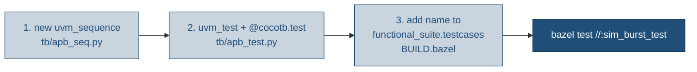

# Tutorial: Bazel + the APB-mem testbench

A hands-on walk through **driving this repo with Bazel** and **using / extending the
pyuvm testbench**. If you just want the command table, see the [README](../README.md);
if you want the terse "gotchas" list, see [CLAUDE.md](../CLAUDE.md). This is the
learn-by-doing version.

Assumes the toolchain from the README is installed (apt Icarus 11, `/usr/bin/python3`
with cocotb 1.9.2 + pyuvm 4.0.1). Verify with:

```bash
bazel test //:ci        # expect 7/7 pass; //:uvm passes by skipping if no UVM sim
```

**Contents**

1. [Bazel in this repo](#part-1--bazel-in-this-repo)
2. [The testbench](#part-2--the-testbench)
3. [Add your own test (end-to-end)](#part-3--add-your-own-test-end-to-end)
4. [The other gates: lint, coverage, low-power, UVM](#part-4--the-other-gates)
5. [JSON results & debugging](#part-5--json-results--debugging)

---

## Part 1 — Bazel in this repo

### 1.1 What Bazel is doing here

Bazel is *not* compiling the RTL itself. It owns three things:

1. **The target graph** — every gate (each functional test, lint, coverage, lp, uvm) is a
   Bazel `test` target. `bazel query //...` lists them.
2. **Runfiles** — it stages the exact source files each target declares into a run dir, so
   a test can only see what it lists in `BUILD.bazel`.
3. **The pass/fail contract** — a target passes iff its launcher exits 0.

The actual simulation is done by the **system toolchain**, reached through a generated bash
launcher. That's deliberate (non-hermetic); see CLAUDE.md for why and for the two toolchain
pins that make it reliable.

| Bazel owns | The host owns |
|---|---|
| target graph, dependencies, runfiles | `iverilog` / `vvp`, `verilator`, `g++` |
| pass/fail (launcher exit code) | the Python interpreter (cocotb + pyuvm) |
| result collection (`result.json`, BEP) | the actual simulation |

### 1.2 The target graph

```bash
bazel query //...                        # every target
bazel query 'tests(//:ci)'               # what the ci suite expands to
bazel query 'attr(tags, sim, //...)'     # everything tagged 'sim'
bazel query 'deps(//:sim_random_test)'   # a target's inputs (sources + runner)
```

The important targets (defined in [`BUILD.bazel`](../BUILD.bazel)):

| Target | What it runs |
|---|---|
| `//:sim_write_read_test`, `//:sim_random_test`, `//:sim_walking_test` | one cocotb testcase each |
| `//:sim` | test_suite of the three above |
| `//:lint` | `iverilog -Wall` + `verilator --lint-only` (verilator part skips if absent) |
| `//:coverage` | Verilator coverage build, gated on a line-coverage floor |
| `//:lp` | low-power UPF-emulated cocotb test |
| `//:uvm` | SV/UVM flow (skips without vcs/xrun/qrun) |
| `//:check`, `//:regress`, `//:ci` | aggregate suites |

### 1.3 Running things

```bash
bazel test //:ci                                   # the full gate
bazel test //:sim                                  # just the three functional tests
bazel test //:sim_random_test                      # a single testcase
bazel test //:sim_random_test --test_output=all    # stream the sim log to your terminal
bazel test //... --test_tag_filters=sim            # tag-based selection (the `pytest -m sim` analog)
```

Two flags you'll reach for constantly:

- `--test_output=all` — show the cocotb/pyuvm log. Without it, Bazel is quiet on a pass.
- `--test_arg=--waves` — forward `--waves` to the runner to dump an FST (into the test's
  `TEST_TMPDIR`). The launcher appends `"$@"`, so any `--test_arg=...` reaches
  `run_cocotb.py`.

```bash
bazel test //:sim_random_test --test_arg=--waves --test_output=all
# or, defaulting to the random test (override with TEST=<name>):
make wave
# the runner preserves the FST in the test's outputs; extract it:
unzip -o "$(bazel info bazel-testlogs)/sim_random_test/test.outputs/outputs.zip" \
      apb_mem.fst -d waves/
```

> **Note on caching:** sim targets are tagged `no-cache`, so re-running always re-executes
> the sim — you never get a stale "(cached) PASSED". That's intentional (the result depends
> on the host toolchain, not just declared inputs). Don't add caching.

### 1.4 What one `bazel test` actually does

```
bazel test //:sim_random_test
        │
        ▼  the cocotb_test rule (bazel/hdl.bzl) generated this at analysis time:
  sim_random_test.sh   →  exec "${APB_PYTHON:-/usr/bin/python3}" bazel/run_cocotb.py \
                              --toplevel apb_mem --module apb_test --module-dir tb \
                              --testcase random_test --source rtl/apb_mem.sv "$@"
        │
        ▼  run_cocotb.py
  cocotb runner: iverilog -g2012 (1ns/1ps)  →  vvp  →  loads apb_test.py
        │
        ▼  apb_test.py
  @cocotb.test random_test  →  uvm_root().run_test("RandomTest")   ← pyuvm takes over
```

One `@cocotb.test` runs per Bazel target, each in its own `vvp` process — that's what gives
every testcase a **fresh, time-0-zeroed memory**. `run_cocotb.py` pins the timescale to
`1ns/1ps` (apt Icarus defaults to 1s precision otherwise) and builds with `-g2012`.

---

## Part 2 — The testbench

### 2.1 Layers

Only the **BFM** touches DUT pins. Everything above it is simulator-agnostic pyuvm.

```
Sequence  ── seq items ──▶  Sequencer ──▶  Driver ──▶  BFM ──▶  DUT pins (apb_mem)
(apb_seq.py)                             (apb_components.py)  (apb_bfm.py)
                                                               │
Scoreboard  ◀── analysis port ──  Monitor  ◀───────── samples completed transfers
(reference byte model)            (apb_components.py)
```

| File | Role |
|---|---|
| `tb/apb_seq_item.py` | `ApbSeqItem` — one APB transfer (addr/data/write + captured `rdata`) |
| `tb/apb_seq.py` | the three stimulus sequences |
| `tb/apb_components.py` | driver, monitor, agent, scoreboard, env |
| `tb/apb_bfm.py` | `ApbBfm` singleton — the only code that drives `PSEL/PENABLE/...` |
| `tb/apb_test.py` | the `uvm_test`s + the `@cocotb.test` entry points |

### 2.2 How a transfer flows

1. A **sequence** builds an `ApbSeqItem` and `start_item`/`finish_item`s it to the sequencer.
2. The **driver** (`ApbDriver.run_phase`) pulls the item, calls `bfm.send_command(...)`, then
   `bfm.get_result()`; on a read it stashes the returned byte into `item.rdata`.
3. The **BFM** (`_transfer`) drives one APB SETUP+ACCESS pair, waits for `PREADY`, samples
   `PRDATA`.
4. The **monitor** independently watches the bus (ACCESS phase with `PREADY` high) and writes
   an observed `ApbSeqItem` out its analysis port.
5. The **scoreboard** keeps a `dict` reference memory: writes update it, reads are checked
   against `model.get(addr, 0)`. Mismatches increment `errors`; `check_phase` asserts
   `errors == 0`.

That scoreboard assertion, plus cocotb's "0 failed" gate, is the whole pass/fail story.

### 2.3 The BFM's two-phase drive (the pin-level bit)

The BFM is the one place signal timing lives. It drives request signals **after** the clock
edge (on `FallingEdge`) so the DUT samples clean values on the next `RisingEdge` — no races.
A single transfer (`_transfer` in `apb_bfm.py`) is:

```
     ┌── FallingEdge ──┐   ┌── FallingEdge ──┐        ┌── FallingEdge ──┐
PCLK ─┘                └───┘                 └── ... ──┘                 └──
PSEL     0    │ 1 (SETUP)   │ 1 (ACCESS)              │ 0 (IDLE)
PENABLE  0    │ 0           │ 1  ← sample PRDATA here │ 0
PADDR    -    │ A           │ A                       │ -
         drive after edge ──┘   RisingEdge: wait PREADY, read PRDATA
```

- **SETUP** (after a falling edge): `PSEL=1`, `PENABLE=0`, address/control driven.
- **ACCESS** (next falling edge): `PENABLE=1`; on the following rising edge, wait for
  `PREADY` (tied high here, so one cycle) and sample `PRDATA`.
- **IDLE**: drop `PSEL`/`PENABLE`.

`ApbBfm` is a pyuvm `Singleton`, so the driver and monitor share one instance and its queues.
`start_bfms()` launches the `driver_bfm`/`monitor_bfm` coroutines that serialise commands onto
the bus and record every completed transfer.

### 2.4 The three sequences (in `apb_seq.py`)

| Sequence | Stimulus | Why |
|---|---|---|
| `ApbWriteReadSeq` | write a random byte, read the same address back (32×) | basic data integrity |
| `ApbRandomSeq` | random read/write mix (64×), reads biased 4:1 to already-written addresses | exercise stored data, not just never-written 0s |
| `ApbWalkingSeq` | first/last addresses × {0x00,0x01,0x55,0xAA,0xFF} | directed corner cases |

Each `uvm_test` in `apb_test.py` is just `BaseTest` with a different `seq_cls`.

---

## Part 3 — Add your own test (end-to-end)

Goal: a **back-to-back writes then verify** sequence, wired up as `//:sim_burst_test`.
Three edits, no rule changes.



### Step 1 — write the sequence (`tb/apb_seq.py`)

```python
class ApbBurstSeq(uvm_sequence):
    """Write an ascending block, then read it all back."""

    def __init__(self, name="ApbBurstSeq", base=0x0100, num=16):
        super().__init__(name)
        self.base = base
        self.num = num

    async def body(self):
        for i in range(self.num):
            wr = ApbSeqItem("wr", addr=self.base + i, data=i & DATA_MASK, write=True)
            await self.start_item(wr)
            await self.finish_item(wr)
        for i in range(self.num):
            rd = ApbSeqItem("rd", addr=self.base + i, write=False)
            await self.start_item(rd)
            await self.finish_item(rd)
```

You get scoreboard checking for free — the monitor sees every transfer and the reference
model already knows what each address was written.

### Step 2 — expose it as a test (`tb/apb_test.py`)

Add the import and a `uvm_test` + a `@cocotb.test` entry point (the testcase name is what
Bazel selects):

```python
from apb_seq import ApbBurstSeq, ApbRandomSeq, ApbWalkingSeq, ApbWriteReadSeq

class BurstTest(BaseTest):
    seq_cls = ApbBurstSeq

@cocotb.test()
async def burst_test(_dut):
    await uvm_root().run_test("BurstTest")
```

### Step 3 — add the Bazel target (`BUILD.bazel`)

`functional_suite` stamps one target per testcase, so just add the name to its list:

```python
functional_suite(
    name = "sim",
    testcases = [
        "write_read_test",
        "random_test",
        "walking_test",
        "burst_test",          # ← new; creates //:sim_burst_test and adds it to //:sim
    ],
    ...
)
```

### Step 4 — run it

```bash
bazel test //:sim_burst_test --test_output=all     # your test alone, with the log
bazel test //:sim                                  # confirm it joined the suite (now 4)
bazel test //:ci                                   # full gate still green
```

That's the whole loop: **sequence → uvm_test + `@cocotb.test` → `functional_suite` name**.
No touching `hdl.bzl` unless you're changing *how* tests are built (new define, new source,
a different top module).

### Variations

- **Extra Verilog define / source** → it's a one-off, not part of the suite: use a bare
  `cocotb_test(...)` (see `//:lp` in `BUILD.bazel`) with `defines = [...]` / extra `sources`.
- **New RTL edge in the DUT** → add sources to the target and, for the SV/UVM flow, to
  `//:uvm`.

---

## Part 4 — The other gates

The functional tests aren't the whole story. Four more gates run under the same
`hdl_tool_test` rule (except `lp`, which is a `cocotb_test`).

### 4.1 Lint — `//:lint`

`bazel/run_lint.py` runs two checks over `rtl/apb_mem.sv`:

1. `iverilog -g2012 -Wall` compile check — a **hard failure** if it errors.
2. `verilator --lint-only -Wall -Wno-DECLFILENAME` — **skips cleanly** if Verilator isn't on
   `PATH` (records `"verilator": "skipped"` in the JSON).

### 4.2 Coverage — `//:coverage`

`bazel/run_coverage.py` does a Verilator `--coverage` build of the RTL, links it against
`sim/sim_main.cpp`, runs it to emit `coverage.dat`, converts to lcov, and gates on a
**line-coverage floor** (`COV_MIN`, default 100%). It skips (exit 0) if Verilator is absent.

```bash
bazel test //:coverage --test_output=all                 # see "[COVERAGE] line coverage X%"
COV_MIN=90 bazel test --test_env=COV_MIN //:coverage      # relax the floor
```

> The DUT's `PSLVERR` tie-off is wrapped in `// verilator coverage_off/on` so the constant
> has no uncoverable point dragging the number below 100%.

### 4.3 Low-power — `//:lp`

`lp/apb_mem_lp.sv` splits the array into a switchable child (`PD_MEM`) to demo a UPF flow
(switch + isolation + retention), hand-modeled behind `` `ifdef LP_EMULATE `` because the
sims aren't UPF-aware. The `//:lp` target compiles with `LP_EMULATE=1` and runs
`lp/test_lp.py`'s `power_cycle_test`, which drives the power pins directly (a minimal APB
master, not the pyuvm stack) and asserts:

| Step | Property | Check |
|---|---|---|
| 1 | powered-on read-back | pattern reads back correctly |
| 2 | isolation | while off, `PREADY=0` and `PRDATA` clamps to `0` (never X on the AON boundary) |
| 3 | retention | power cycle with `ret=1` preserves contents |
| 4 | corruption | power cycle with `ret=0` loses them (reads X) — proves retention did work |

```bash
bazel test //:lp --test_output=all      # watch the 5 "[...] OK" log lines
```

### 4.4 UVM — `//:uvm`

The `uvm/` tree is a full SystemVerilog UVM testbench, plus `uvm/apb_sva.sv` — a checker
`bind`-ed to every `apb_mem` (protocol rules + this slave's tie-offs; see the README table).
`bazel/run_uvm.py` looks for `vcs` / `xrun` / `qrun` and **skips (exit 0)** if none is
licensed, which is the case on the dev host. On a licensed host:

```bash
UVM_TEST=apb_random_test bazel test --test_env=UVM_TEST //:uvm
```

---

## Part 5 — JSON results & debugging

Every test writes a machine-readable `result.json` and echoes a `[JSON] {...}` line:

```bash
bazel test //:sim_random_test --test_output=all | grep '\[JSON\]'
# or pull the file Bazel archived:
unzip -p "$(bazel info bazel-testlogs)/sim_random_test/test.outputs/outputs.zip" result.json
```

The payload always has `gate` + `status`; the rest depends on the gate:

| Gate | Extra fields |
|---|---|
| `sim` / `lp` | `testcase`, `toplevel`, `tests`, `failed` |
| `lint` | `iverilog`, `verilator` |
| `coverage` | `line_pct`, `floor` (or `reason` when skipped) |
| `uvm` | `simulator`, `uvm_test` (or `reason` when skipped) |

`--config=json` additionally streams the whole invocation to `bazel-events.json` (BEP).

### Debugging a failure

1. Re-run the one target with `--test_output=all` to see the pyuvm log.
2. Look for the scoreboard line: `MISMATCH @0xADDR: got 0xXX exp 0xYY` — it names the
   address and both bytes.
3. Re-run with `--test_arg=--waves` and open the FST to see the pins around that address.

```bash
make wave                    # = bazel test //:sim_random_test --test_arg=--waves ...
unzip -o "$(bazel info bazel-testlogs)/sim_random_test/test.outputs/outputs.zip" \
      apb_mem.fst -d waves/
gtkwave waves/apb_mem.fst tb/apb_mem.gtkw      # a saved signal layout ships in tb/
```

### Common gotchas

| Symptom | Cause / fix |
|---|---|
| cocotb import error or hang | wrong Python — the launcher uses `/usr/bin/python3` (cocotb 1.9.2), not the oss-cad-suite cocotb 2.x on `PATH`. Override: `--test_env=APB_PYTHON=/path/to/python`. |
| No sim log on a pass | add `--test_output=all` (Bazel is quiet by default). |
| `//:uvm` "passes" instantly | it's skipping — no licensed UVM simulator. Expected here. |
| `//:lint` / `//:coverage` skip | no Verilator on `PATH`. Install it to enable them. |
| Stale-looking result | there isn't one — sim targets are `no-cache` and always re-run. |
